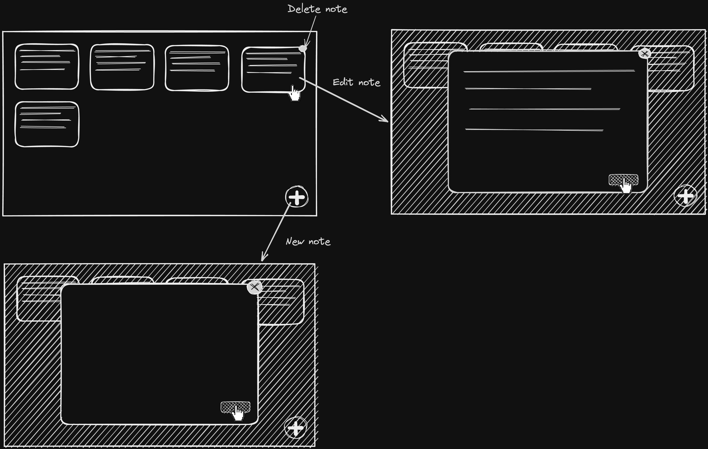

# Notes Webapp LND

A simple web based note taking application.

https://notes.nicholascannon.com

Want to see a version using Webpack, Babel and Jest?
See [this branch](https://github.com/nicholascannon/notes-webapp-lnd/tree/webpack-babel-jest).

### Motivation

The codebase is built to scale to a larger application worked on by multiple people.
It's meant to be a realistic example of production React apps depended on by businesses.

## How to run things

Navigate to the `app` directory and install dependencies:

```bash
cd app && npm ci
```

Run the app in dev mode:

```bash
npm start
```

Build the app:

```bash
npm run build
```

Application is built to `./app/dist`

Run the test suite:

```bash
npm run test
```

## Stack

### Production stack

-   React
-   Emotion
-   Framer motion
-   React DnD

### Tooling stack

-   Vite
-   Vitest
-   TypeScript
-   Eslint
-   Prettier
-   Lint staged
-   Husky
-   Testing library
-   Knip
-   Cypress

## Wireframe



## Relevant links

-   [Bullet Proof React](https://github.com/alan2207/bulletproof-react)
